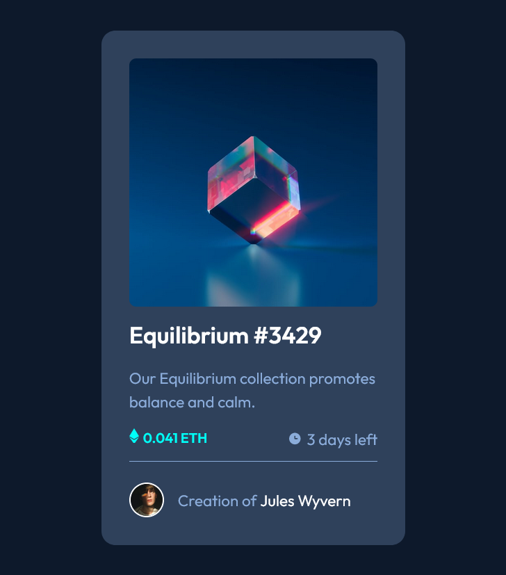

# Frontend Mentor - NFT preview card component solution

This is a solution to the [NFT preview card component challenge on Frontend Mentor](https://www.frontendmentor.io/challenges/nft-preview-card-component-SbdUL_w0U). Frontend Mentor challenges help you improve your coding skills by building realistic projects. 

## Table of contents

- [Overview](#overview)
  - [The challenge](#the-challenge)
  - [Screenshot](#screenshot)
  - [Links](#links)
- [My process](#my-process)
  - [Built with](#built-with)
  - [What I learned](#what-i-learned)
  - [Continued development](#continued-development)
  - [Useful resources](#useful-resources)
- [Author](#author)


## Overview

### The challenge

Users should be able to:

- View the optimal layout depending on their device's screen size
- See hover states for interactive elements

### Screenshot




### Links

- Solution URL: [My Solution](https://github.com/shashikantdev3/FrontendMentor-order-summary-component-main)
- Live Site URL: [Add live site URL here](https://shashikantdev3.github.io/FrontendMentor-order-summary-component-main)

## My process

### Built with

- Semantic HTML5 markup
- CSS custom properties
- Flexbox
- CSS Grid


### What I learned

I learned to place a png image (an avatar) beside a text, in earlier projects I have implemented the SVG image placement behind the text. In this project I also learned about the Overlay Image.

Overlay image is an image that is on the top of one image and in this project I have implament it for hover effect using position: relative at parent div and postion: absolute , display: flex(justify-item: center, allign-item: center) at overlay-active div(child div)

Below is the HTML and CSS for both Overlay Image and Avatar
, see below:

```html

<!-- Overlay Imagge -->
    <picture class="product__img card__overlay">
      
      <div class="overlay__active">
        
      </div>
    </picture>

 <!-- AVATAR -->
  <footer class="product__footer">
      
      <p class="created_by">Creation of <span class="creator__name">Jules Wyvern</span></p>
    </footer>

```
```css
/*  Overlay Imagge  */

.card__overlay{
  position: relative;
}

.overlay__img{
   border-radius: 0.5rem;
}

.overlay__active{
  position: absolute;
  top: 0;
  left: 0;
  right: 0;
  bottom: 0;
  width: 100%;
  height: 100%;
  display: flex;
  justify-content: center;
  align-items: center;
  opacity: 0;
}

.card__overlay:hover .overlay__active{
  background-color: var(--clr-cyan-transparent);
  opacity: 1;
  cursor: pointer;
  transition: 0.3s;
  border-radius: 0.5rem;
}


/* Avatar and Footer */

.product__footer{
  display: flex;
  padding: 1rem 1rem 0 0;
  gap: 1rem;
  align-items: center;
}

.avatar{
  vertical-align: middle;
  width: 40px;
  height: 40px;
  border-radius: 40px;
  border: 2px solid var(--clr-white);
}

```
`

If you want more help with writing markdown, we'd recommend checking out [The Markdown Guide](https://www.markdownguide.org/) to learn more.

**Note: Delete this note and the content within this section and replace with your own learnings.**


### Useful resources

- [Example resource 1](https://www.example.com) - This helped me for XYZ reason. I really liked this pattern and will use it going forward.
- [Example resource 2](https://www.example.com) - This is an amazing article which helped me finally understand XYZ. I'd recommend it to anyone still learning this concept.


## Author

- Website - [Shashikant](https://www.your-site.com)
- Frontend Mentor - [@shashikantdev3](https://www.frontendmentor.io/profile/shashikantdev3)
- Twitter - [@shashikantdev3](https://www.twitter.com/shashikantdev3)

**Note: Delete this note and add/remove/edit lines above based on what links you'd like to share.**

## Acknowledgments

This is where you can give a hat tip to anyone who helped you out on this project. Perhaps you worked in a team or got some inspiration from someone else's solution. This is the perfect place to give them some credit.

**Note: Delete this note and edit this section's content as necessary. If you completed this challenge by yourself, feel free to delete this section entirely.**
